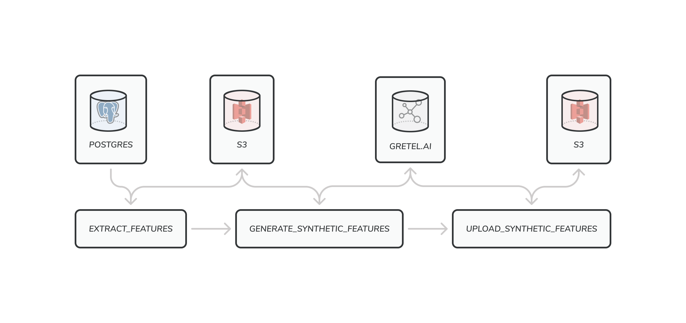

# Gretel Airflow Pipeline Examples

This repository contains resources and references for integrating Gretel APIs with Airflow.

## Pipelines

### Airbnb User Bookings - `dags/airbnb_user_bookings.py`

Using an [Airbnb Booking Dataset](https://www.kaggle.com/c/airbnb-recruiting-new-user-bookings) from Kaggle we build a data pipeline for extracting features from a user session database.



The accompanying blog post can be found here

> https://gretel.ai/blog/running-gretel-on-apache-airflow

## Getting Started

Before getting started, the following tools must be installed on your computer

- Docker v20.10 or greater
- Docker Compose v1.29 or greater

You will also need a set of AWS credentials and a bucket to store intermediate files that are generated during pipeline runs.

### 1. Generate a Gretel API Key and setup a Gretel Project.

Now that your system is setup, you will need to generate a Gretel API key, and create a new project for the walkthrough.

For a detailed guide how to setup your Gretel account, please refer to our main doc site, https://docs.gretel.ai/environment-setup#console-sign-up-and-project-creation.

### 2. Configure Airflow connections.

Next, we need to configure a few Airflow connections. The pipeline has external dependencies on PostgreSQL, S3 and Gretel. These connections are managed as environment variables and injected into the Airflow worker during startup.

To configure each connection

1. First copy `.env.sample` to `.env`

```
cp .env.sample .env
```

2. Next, update `AIRFLOW_CONN_GRETEL_DEFAULT` and `AIRFLOW_CONN_S3_DEFAULT` variables with their respective secrets.

The PostgreSQL connection details are hardcoded into the docker-compose.yml file and don't need to be updated.

### 3. Start Airflow

After the Airflow connections have been configured, you can start the Airflow server by running

```
make setup
make start
```

This will command will start a local Airflow cluster on http://localhost:8080/ backed by PostgreSQL and Redis. To stop the server, you can ctrl-c from the terminal after starting the service.

The username and password for the airflow instance is `airflow`/`airflow`.

### 4. Seed the source database

The bookings pipeline uses a [Airbnb Booking Kaggle Dataset](https://www.kaggle.com/c/airbnb-recruiting-new-user-bookings) and needs to be loaded into the database before continuing.

```
make seed
```

This command may take a few minutes to run.

### 5. Run the User Bookings Pipeline

Now that the Airflow environment and external dependencies are configured, you can navigate to the example pipeline, http://localhost:8080/tree?dag_id=gretel_synthetics_airbnb_bookings and trigger the job


Alternatively you can trigger the DAG from the CLI

```
./airflow.sh dags trigger gretel_synthetics_airbnb_bookings
```

If the pipeline has run successfully, you should see the original and synthetic feature CSVs in the configured s3 bucket.
